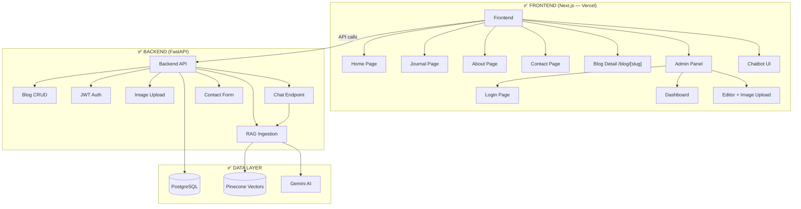

# Morrigan — Implementation Plan

## Current Architecture



---

## Phase Status

| Phase | Description | Status |
|-------|-------------|--------|
| **Phase 1** | Backend API (CRUD + Auth + Upload + RAG) | ✅ Complete |
| **Phase 2** | Frontend API Layer (`api.ts` + `auth-context.tsx` + `types.ts`) | ✅ Complete |
| **Phase 3** | Wire Up Pages to Live Data + Contact Form + Chatbot | ✅ Complete |
| **Phase 4** | Chatbot RAG Connection + Page Context | ✅ Complete |
| **Phase 5** | Admin Polish + Editor Improvements | ✅ Complete |
| **Phase 6** | Production Deployment | 🔲 Not Started |

---

## ✅ Phase 1 — Backend API (Complete)

All backend code is production-ready:

| Component | File(s) | Status |
|-----------|---------|--------|
| Blog CRUD | `api/blogs.py`, `services/blog_service.py` | ✅ |
| Auth (JWT) | `api/admin.py`, `utils/auth.py` | ✅ |
| Image Upload | `api/upload.py` | ✅ |
| Contact Form | `api/contact.py` | ✅ |
| Chat (RAG) | `api/chat.py`, `services/ai_service.py` | ✅ |
| RAG Ingestion | `services/rag_ingestion_service.py` | ✅ |
| Database Models | `database/models.py` (Blog + Contact) | ✅ |
| Database Schemas | `database/schemas.py` | ✅ |

**Auto-RAG Pipeline:** When a blog is published via admin, `blog_service.py` automatically calls `process_and_store_blog()` which chunks the content, generates embeddings via Gemini, and stores vectors in Pinecone.

---

## ✅ Phase 2 — Frontend API Layer (Complete)

| File | Purpose | Status |
|------|---------|--------|
| `frontend/src/lib/api.ts` | API client (fetchBlogs, createBlog, deleteBlog, loginAdmin, uploadImage, submitContact, sendChatMessage) | ✅ |
| `frontend/src/lib/auth-context.tsx` | AuthProvider + useAuth hook (JWT in localStorage) | ✅ |
| `frontend/src/lib/types.ts` | Centralized TypeScript interfaces (Blog, ChatPayload, ContactPayload, etc.) | ✅ |
| `frontend/.env.local` | `NEXT_PUBLIC_API_URL=http://localhost:8000/api` | ✅ |

**Demo data removed:** `demo-data.ts` has been deleted. All pages now rely exclusively on the backend API.

---

## ✅ Phase 3 — Wire Up Pages (Complete)

| Page | What was done | Status |
|------|---------------|--------|
| **Home (`/`)** | Fetches blogs from API, passes to CategoryScroll with loading state | ✅ |
| **Journal (`/journal`)** | Fetches blogs from API, skeleton loading, category filtering | ✅ |
| **Blog Detail (`/blog/[slug]`)** | Fetches single blog from API, loading + 404 states | ✅ |
| **Admin Login** | Wired to `useAuth().login()` → backend JWT auth | ✅ |
| **Admin Dashboard** | Fetches from `fetchAdminBlogs()`, real delete with `deleteBlog()` | ✅ |
| **Admin Editor** | Creates/updates via API, image upload via `uploadImage()` | ✅ |
| **Contact Form** | Wired to `submitContact()` → saves to PostgreSQL | ✅ |
| **Skeleton Loaders** | CategorySkeleton, JournalSkeleton components | ✅ |

---

## ✅ Phase 4 — Chatbot RAG Connection (Complete)

| Component | What was done | Status |
|-----------|---------------|--------|
| **Chatbot.tsx** | Replaced mock `setTimeout` with real `sendChatMessage()` API call | ✅ |
| **Page Context** | Sends `page_url` + `page_content` (article text) to RAG for context-aware answers | ✅ |
| **Error Handling** | Graceful fallback message on API failure | ✅ |

**Requires API Keys:** Chatbot will only give real answers once `GEMINI_API_KEY` and `PINECONE_API_KEY` are set in `Backend/.env`.

---

## ✅ Phase 5 — Admin Polish + Editor Improvements (Complete)
- **Rich Text Editor**: Integrated TipTap/React Quill for full formatting.
- **Tag Input**: Added chip-based tag management.
- **Blog Preview**: Live preview tab added to the editor.
- **Dashboard**: Added search, status filtering, and bulk actions.
- **Image handling**: Drag-and-drop + URL support + live previews.

---

## 🔲 Phase 6 — Production Deployment
> **Goal:** Host everything live on the internet with zero cost (or near-zero).
> **Effort:** ~3–4 hours

### 6.1 Hosting Strategy

| Component | Provider | Cost | Notes |
|-----------|----------|------|-------|
| **Frontend** (Next.js) | Vercel | **Free** | Best for Next.js, auto-deploys from GitHub |
| **Backend** (FastAPI) | Render or Railway | **~$5-7/mo** | Avoid free tier (cold starts slow down chatbot) |
| **Database** (PostgreSQL) | Neon.tech | **Free** | 500MB free tier, auto-scaling |
| **Vector DB** (Pinecone) | Pinecone | **Free** | 1 free index, enough for thousands of articles |
| **Media/Uploads** | Cloudinary | **Free** | 25GB bandwidth/mo free, global CDN |

### 6.2 Pre-Deployment Checklist

| Task | Description |
|------|-------------|
| **Cloudinary Integration** | Update `upload.py` to send images to Cloudinary instead of local `uploads/` folder |
| **Environment Variables** | Move all `.env` keys to Vercel/Render dashboards |
| **Database Migration** | Run `init_database.py` against Neon.tech PostgreSQL URL |
| **CORS Update** | Set `ALLOWED_ORIGINS` to your Vercel domain (not `*`) |
| **API URL Update** | Set `NEXT_PUBLIC_API_URL` in Vercel to Render backend URL |
| **Security Hardening** | Generate strong `SECRET_KEY`, set `ADMIN_PASSWORD_HASH` |
| **Custom Domain** | Point domain DNS to Vercel, optional API subdomain |

### 6.3 Deployment Steps

```
1. Create Neon.tech account → get PostgreSQL URL
2. Create Render account → deploy Backend from GitHub
3. Set all env vars on Render (DB URL, API keys, secrets)
4. Run init_database.py against cloud DB
5. Create Vercel project → deploy Frontend from GitHub
6. Set NEXT_PUBLIC_API_URL on Vercel to Render URL
7. Test all flows (login, create blog, chatbot, contact)
8. Connect custom domain
```

---

## Priority Order

| Phase | What | Status | Est. Time |
|-------|------|--------|-----------|
| **1** | Backend API (CRUD + Auth + Upload + RAG) | ✅ Done | — |
| **2** | Frontend API layer (`api.ts` + auth context) | ✅ Done | — |
| **3** | Wire up all pages to live data | ✅ Done | — |
| **4** | Connect chatbot UI to RAG backend | ✅ Done | — |
| **5** | Admin polish + editor improvements | ✅ Done | — |
| **6** | Production deployment | 🔲 Next | ~3–4 hours |

**Remaining estimated:** ~3–4 hours (mostly setup/hosting)
